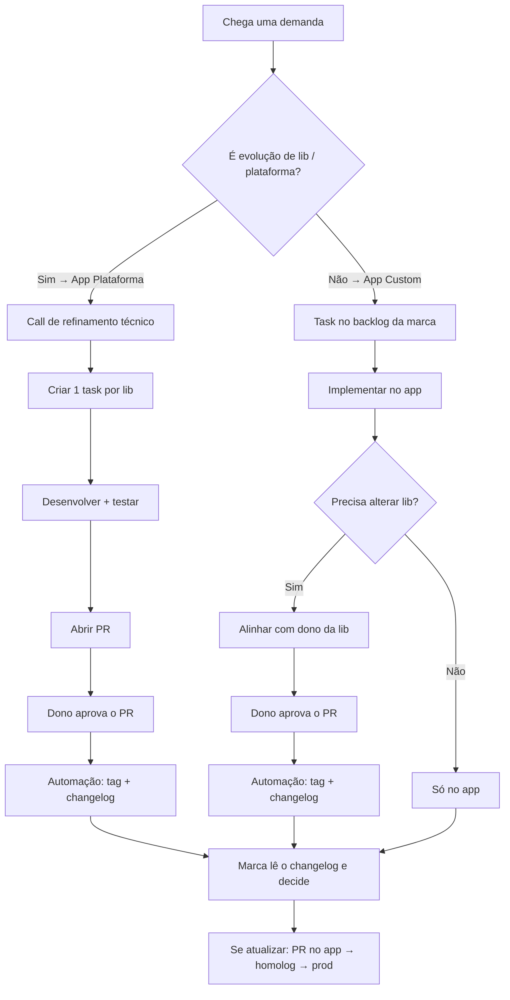
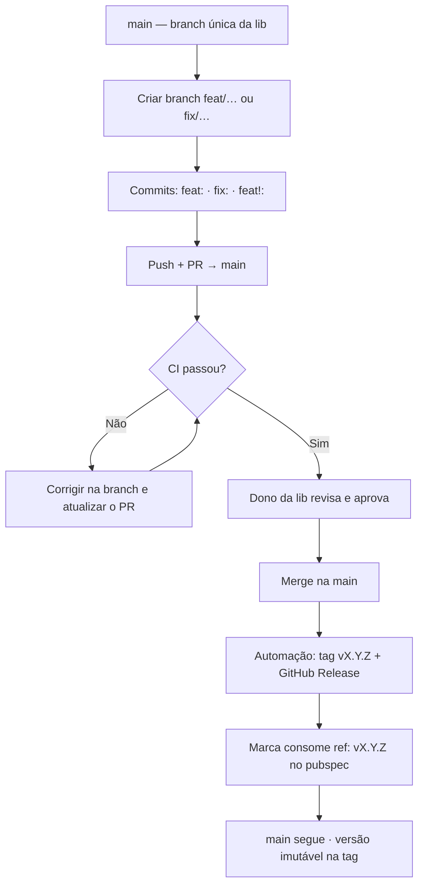
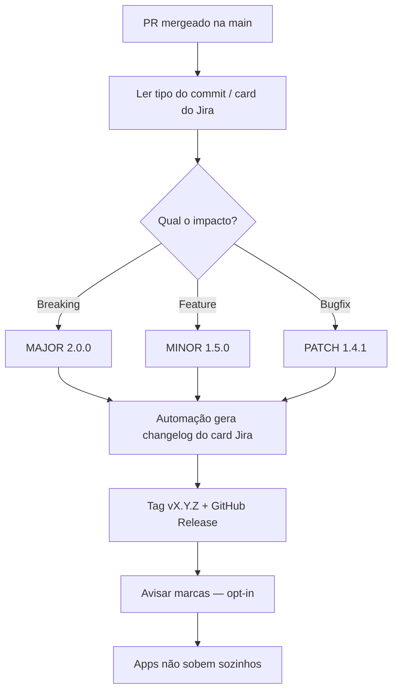
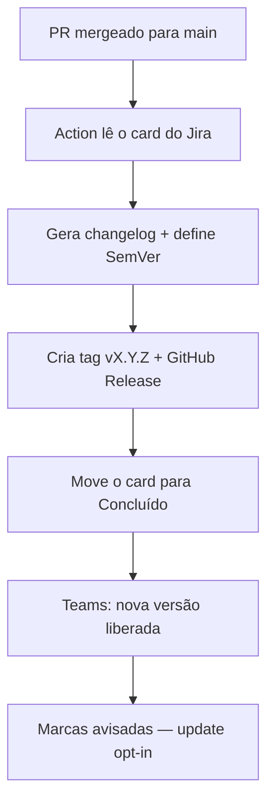
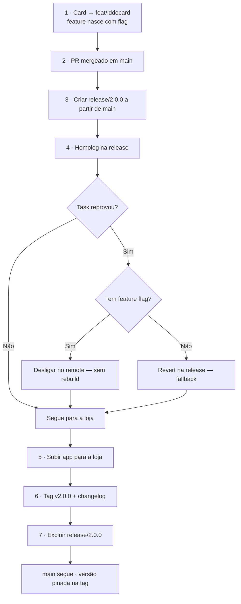
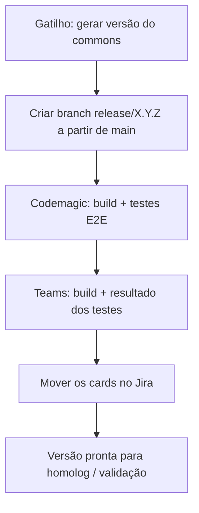
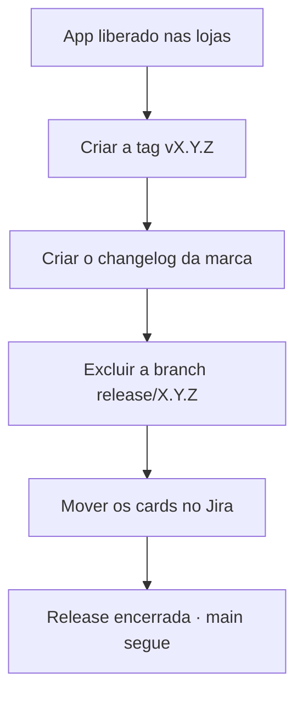

import Kicker from '@site/src/components/Kicker';

<Kicker>03 · Fluxogramas</Kicker>

# Mapas do processo

Referência rápida ponta a ponta. Os SVGs originais estão em [legado/processos.html](pathname:///legado/processos.html).

## 1. Processo de desenvolvimento

Do pedido até a marca decidir atualizar (ou não).

## 2. Processo Git (libs)

Uma branch principal · feature branch · PR · tag.

:::warning[Não usar]
develop / homolog como contrato para a marca. O que vale é a **tag**.
:::

## 3. Lançamento de versão da lib

Depois do merge na main — SemVer + changelog.

## 4. Automação para gerar versão da lib

GitHub Action depois do merge — Jira, tag, Teams.

:::tip[Pré-requisito]
O PR precisa referenciar o card do Jira (chave na branch ou na descrição) para a Action achar a task.
:::

## 5. Release da marca (App Custom)

Feature flag primeiro · revert só se não houver flag.

:::danger[Regra]
Toda feature nasce com feature flag. Reprovou → **desliga no remote**. Sem flag → **revert na release**.
:::

## 6. Automação para gerar versão do commons

Criar release a partir da main → build + E2E → Teams → Jira.

## 7. Automação pós-release

Depois que o app está nas lojas.

A automação 6 cobre o início do ciclo (release + build + E2E); a 7 cobre o fechamento depois da loja (tag + changelog + limpeza). Detalhe operacional: [Automações](./automacoes.mdx) e [Skills de Release](../skills-release/index.md).
