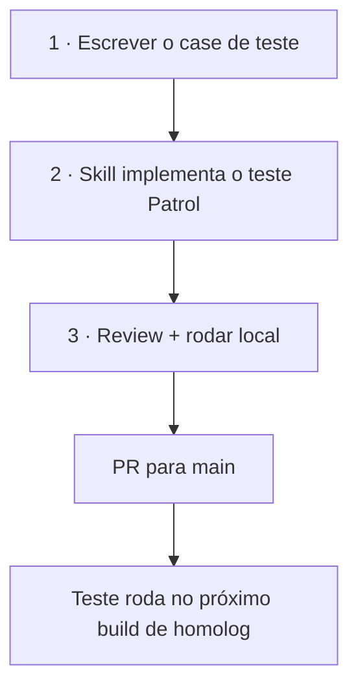
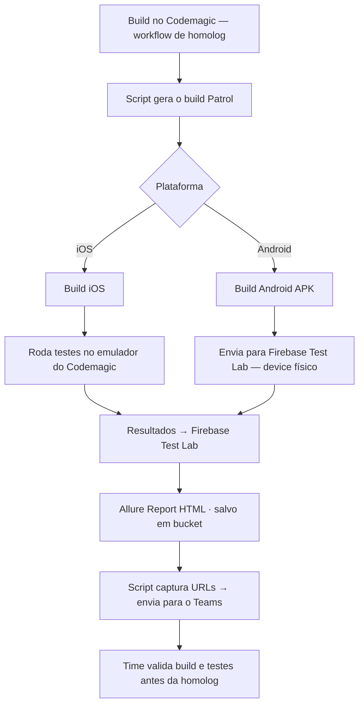

import Kicker from '@site/src/components/Kicker';
import DocCard, {CardGrid} from '@site/src/components/DocCard';
import Chip, {Chips} from '@site/src/components/Chip';

<Kicker>10 · Qualidade</Kicker>

# Testes end-to-end (E2E)

Cobrir os fluxos principais do app com testes automatizados — reduz regressão e dá confiança na homolog e na subida para a loja.

<CardGrid>
  <DocCard title="Situação atual — sem cobertura E2E" tone="coral">
    Projeto ainda sem testes end-to-end nos fluxos críticos. Alto risco de regressão em releases com muitas tasks. Dificuldade de evoluir o app com segurança.
  </DocCard>
  <DocCard title="Meta — estratégia mínima" tone="teal">
    Definir casos de teste para fluxos principais. Automatizar com Patrol no pipeline de homolog. Reportar resultado (Allure + Teams) a cada build.
  </DocCard>
</CardGrid>

<Chips>
  <Chip tone="teal">Patrol — E2E Flutter</Chip>
  <Chip tone="amber">Codemagic — build homolog · emulador iOS</Chip>
  <Chip tone="coral">Firebase Test Lab — device Android</Chip>
  <Chip tone="blue">Allure Report — HTML · bucket</Chip>
</Chips>

## Fluxo de desenvolvimento do teste

Do case ao PR — antes de entrar no pipeline.

## Pipeline E2E na homolog

Disparado no workflow de homolog do Codemagic (release da marca).

:::tip[Encaixa na automação de versão]
Ao gerar versão (brand-release / commons), o Codemagic roda build + E2E e manda build + resultado dos testes no Teams antes de mover os cards no Jira. Ver [Fluxogramas · automação 6](./fluxogramas.mdx#6-automação-para-gerar-versão-do-commons) e [Automações](./automacoes.mdx).
:::
